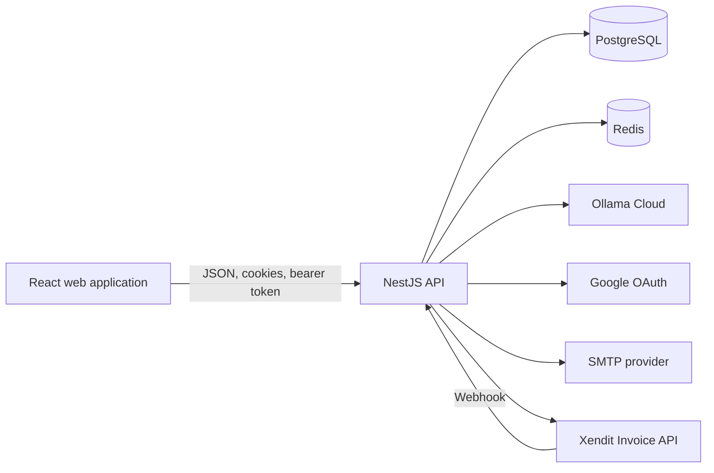
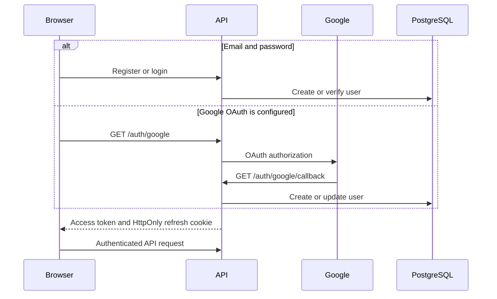
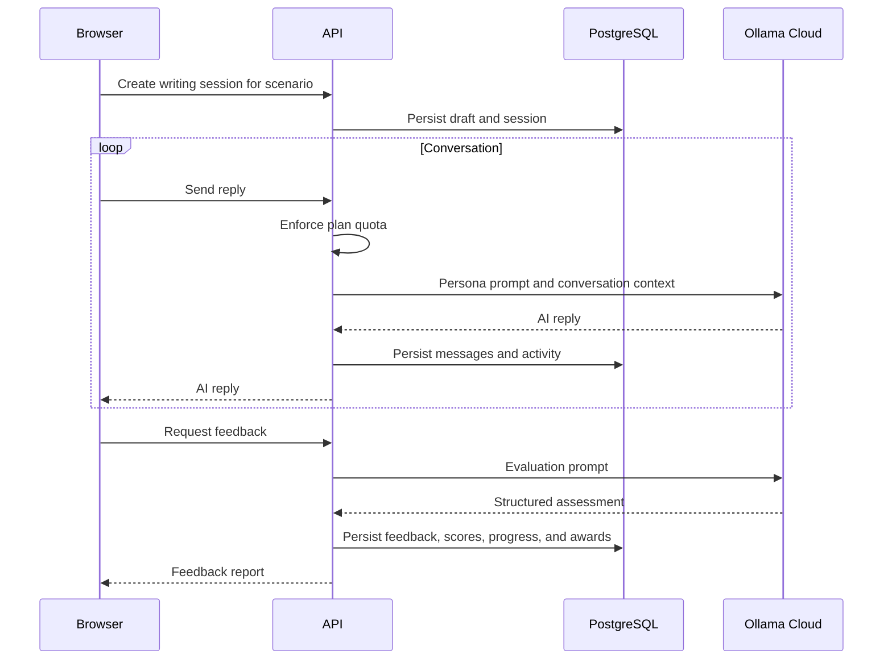
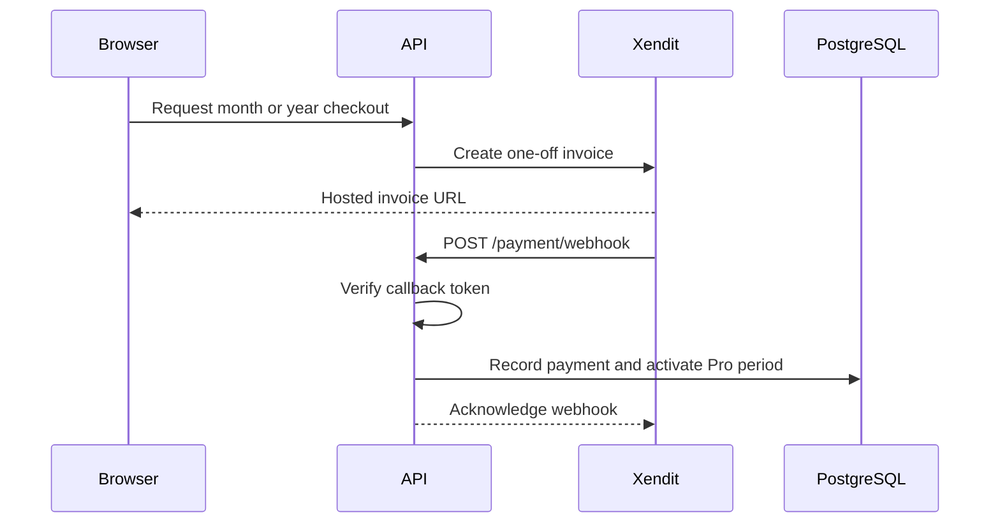

# Architecture

Mail Mentor is a browser application backed by a modular NestJS API. PostgreSQL is the source of truth; Redis supports caching. The API integrates directly with Ollama Cloud, Google OAuth, SMTP, and Xendit.

## Runtime boundaries

### Frontend

The React application owns routing, forms, editor interactions, local UI state, and authenticated API requests. Zustand stores coordinate authentication, conversations, scenarios, feedback, proficiency, streaks, badges, settings, and access status. Production builds are static assets served by Nginx with SPA fallback routing.

### Backend

The NestJS application owns authentication, authorization, quotas, domain operations, provider integrations, persistence, logging, and public error handling. Controllers expose HTTP routes; services enforce behavior; Prisma repositories access PostgreSQL.

### Data and cache

PostgreSQL stores users, writing sessions, messages, feedback, practice history, proficiency data, badges, access periods, and payments. Prisma migrations are the schema history. Redis is not authoritative and should be safe to rebuild.

## Domain vocabulary

| Term              | Meaning                                                                                      |
| ----------------- | -------------------------------------------------------------------------------------------- |
| Scenario          | A practice situation with an AI persona, goal, and communication style                       |
| Conversation      | User-facing name for an email exchange                                                       |
| Writing session   | Persisted backend representation of a conversation                                           |
| AI reply          | In-character response generated during a writing session                                     |
| Feedback report   | Assessment generated after a session ends                                                    |
| Skill proficiency | Aggregated Grammar, Clarity, Etiquette, Structure, Professional Tone, and Conciseness scores |
| Pro access period | Fixed one-month or one-year period activated after a paid Xendit invoice                     |

Scenario levels are `Beginner`, `Intermediate`, and `Advanced`.

## Important flows

### Authentication

The refresh cookie uses `SameSite=Lax` without `Secure` in development and `SameSite=None; Secure` in production. Production frontend and backend URLs must therefore use HTTPS.

### Practice and feedback

AI calls use Ollama Cloud and time out after 55 seconds. Detailed feedback is post-session, not real-time coaching while typing.

### Pro access purchase

The integration does not create a provider-side recurring agreement. Local cancellation state does not cancel anything at Xendit.

## Backend route map

This is an orientation map, not an executable API specification.

| Area             | Route families                                                                |
| ---------------- | ----------------------------------------------------------------------------- |
| Liveness         | `GET /health`                                                                 |
| Authentication   | `/auth/register`, `/auth/login`, `/auth/refresh`, `/auth/google`, `/auth/me`  |
| Users            | `/users/me`, profile updates, email verification, deletion, and export        |
| Scenarios        | `/scenarios`, `/scenarios/progress`, `/scenarios/:id`                         |
| Writing sessions | `/writing-session/create`, `/writing-session/me`, session detail and feedback |
| AI               | `/writing-sessions/:sessionId/reply` and `/feedback`                          |
| Progress         | `/skill-proficiency`, `/recent-scores`, `/streaks`, `/badges`                 |
| Access           | `/subscription` and `/subscription/me`                                        |
| Payments         | `/payment`, including the public Xendit webhook                               |

There is no global API prefix and no OpenAPI document. Consult controller source and DTOs for exact request and response shapes.

## Cross-cutting behavior

- Global validation rejects unknown DTO fields.
- CORS allows credentials and exposes `X-Request-ID`.
- Access and refresh tokens use separate secrets.
- Request completion logs are structured JSON with sensitive data redacted.
- Public server errors do not expose provider responses or internal exception details.
- `GET /health` is liveness only; it does not check PostgreSQL, Redis, or external providers.
